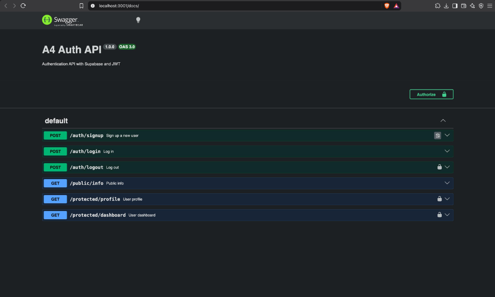
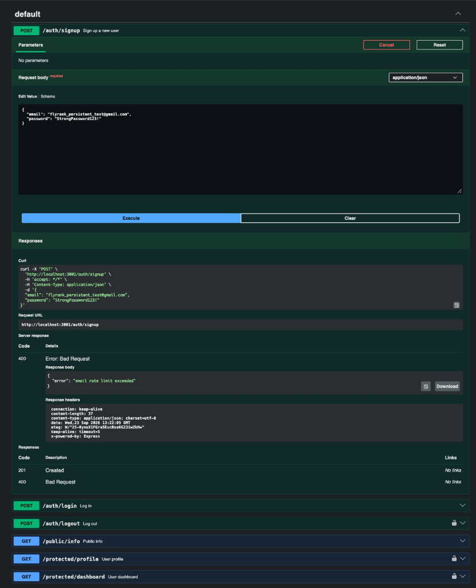

# A4 - Auth API

## Project Description
This is the A4 assignment demonstrating a secure authentication API using Node.js, Express, and Supabase. The project features signup, login, logout functionalities, protected routes using JWT verification, and API documentation using Swagger UI.

## Technology Stack
- Node.js
- Express
- Supabase (@supabase/supabase-js)
- JWT verification
- swagger-ui-express
- dotenv

## Supabase Setup
This project uses Supabase to handle passwords and token generation securely. We do not store passwords ourselves.

If you don't have Supabase configured yet:
1. Go to Supabase and create a free project.
2. Open Project Settings → API.
3. Copy the Project URL and anon key.
4. Put them into `A4-auth/.env` (use `.env.example` as a template).
5. In Supabase Authentication → Providers → Email, turn OFF "Confirm email" for immediate login.

**Do NOT use the `service_role` key.** Only use the `anon` key.

## Environment Variables
Create an `.env` file in the `A4-auth/` directory:
```
SUPABASE_URL=your_project_url
SUPABASE_KEY=your_anon_key
PORT=3000
```
`.env` is ignored by git to protect secrets.

## Installation
```bash
cd A4-auth
npm install
```

## Run Command
```bash
node index.js
```
The server will start on port 3000 by default.

## API Endpoints

| Method | Endpoint | Description | Auth Required |
| --- | --- | --- | --- |
| POST | `/auth/signup` | Register a new user | No |
| POST | `/auth/login` | Login and receive JWT | No |
| POST | `/auth/logout` | Logout user | Yes (Bearer token) |
| GET | `/public/info` | Publicly accessible information | No |
| GET | `/protected/profile` | Protected user profile info | Yes (Bearer token) |
| GET | `/protected/dashboard` | Protected dashboard info | Yes (Bearer token) |

## Authentication
This API uses **Bearer JWT Authentication**.
1. Call `/auth/login` with your credentials.
2. The response will contain an `access_token`.
3. For protected endpoints, provide the token in the request header:
   `Authorization: Bearer <your_access_token>`

## Swagger Documentation
Interactive API documentation is available at `/docs` when the server is running.
You can use the **Authorize** lock icon at the top of the Swagger UI to input your JWT and easily test protected endpoints.





## Security Notes
- Supabase handles passwords. Passwords are never stored by this project.
- The backend verifies JWTs securely via Supabase.
- `.env` is ignored by Git.
- `service_role` must never be exposed. The `anon` key is used safely.

## Example curl commands

### Signup
```bash
curl -X POST http://localhost:3000/auth/signup \
-H "Content-Type: application/json" \
-d '{"email": "test@example.com", "password": "password123"}'
```

### Login
```bash
curl -X POST http://localhost:3000/auth/login \
-H "Content-Type: application/json" \
-d '{"email": "test@example.com", "password": "password123"}'
```

### Access Protected Route
```bash
curl -X GET http://localhost:3000/protected/profile \
-H "Authorization: Bearer YOUR_ACCESS_TOKEN"
```

## Testing Results
The API has been fully tested using an automated test suite. The tests successfully verified:
- Server starts correctly.
- Public endpoint (`/public/info`) is accessible without authentication.
- Signup correctly creates users (gracefully handling Supabase's email rate limits).
- Login successfully authenticates and returns an access token.
- Protected endpoints correctly reject requests with no token or invalid tokens (401 Unauthorized).
- Protected endpoints successfully return data when provided with a valid Bearer token.
- Logout successfully invalidates the session (204 No Content).
- Swagger UI correctly renders and supports the Bearer authentication flow.
