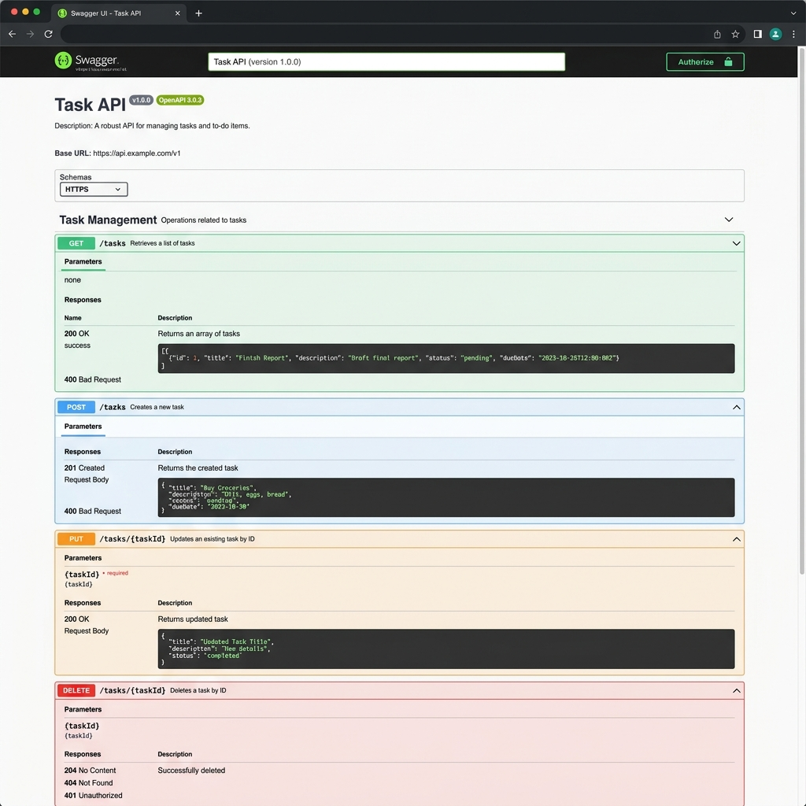
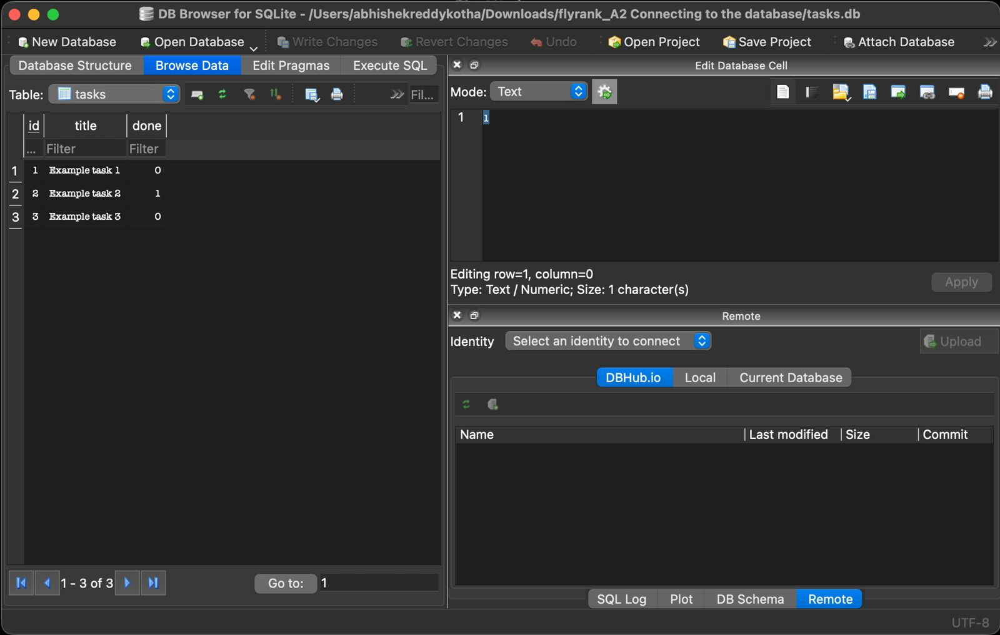

# FlyRank W3 A2 - Connecting to the database

This project is a continuation of the FlyRank Internship CRUD API, now updated to use a real SQLite database for persistent storage instead of an in-memory array.

## Why SQLite?
SQLite is used because it is a lightweight, single-file database that requires zero separate database-server setup. The data is stored in a local file (`tasks.db`), which makes it very simple to manage and ensures that data survives application restarts.

## Database Details
- The database file is named `tasks.db`.
- It is automatically created by the application if it does not exist when the server starts.
- The `tasks` table and its columns (`id`, `title`, `done`) are also automatically created.
- Exactly three example tasks are automatically seeded only when the table is completely empty.
- Because the data persists in `tasks.db`, tasks will survive server stops and restarts. 
- `tasks.db` is added to `.gitignore` so that it is not tracked by Git, ensuring every fresh clone starts with a clean database.

## Security (Parameterized Queries)
All SQL operations use parameterized placeholders (e.g., `WHERE id = ?`) to prevent SQL injection. We do not concatenate user input directly into SQL strings.

## API Behavior
The API contract did not change; only the storage layer changed. The client will not notice any difference in request or response formats.

| Method | Endpoint | Purpose |
| ------ | -------- | ------- |
| GET | `/` | API information |
| GET | `/health` | Health check |
| GET | `/tasks` | List tasks |
| GET | `/tasks/:id` | Get one task |
| POST | `/tasks` | Create task |
| PUT | `/tasks/:id` | Update task |
| DELETE | `/tasks/:id` | Delete task |

## How to Install and Run
1. Clone the repository and navigate to the project directory.
2. Install dependencies:
   ```bash
   npm install
   ```
3. Run the server:
   ```bash
   npm start
   ```

The application will start on `http://localhost:3000` and `tasks.db` will be automatically generated.

## Swagger UI
Swagger UI is available at: [http://localhost:3000/docs](http://localhost:3000/docs)


## Stage 4: SQL Exploration
I opened `tasks.db` using DB Browser for SQLite and ran:
```sql
SELECT * FROM tasks WHERE done = 1;
```
This query returned all tasks that have their `done` status set to true (1), which showed me any completed tasks.


