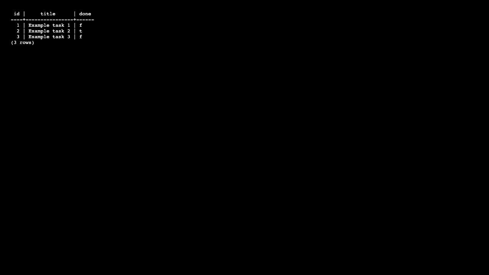

# FlyRank Backend Internship

This repository contains the completed assignments for the FlyRank Backend AI Engineering internship.

## A1 & A2 — CRUD API and Database Connectivity

This project implements a CRUD API, utilizing a real SQLite database for persistent storage instead of an in-memory array.

### Why SQLite?
SQLite is used because it is a lightweight, single-file database that requires zero separate database-server setup. The data is stored in a local file (`tasks.db`), which makes it very simple to manage and ensures that data survives application restarts.

### Database Details
- The database file is named `tasks.db`.
- It is automatically created by the application if it does not exist when the server starts.
- The `tasks` table and its columns (`id`, `title`, `done`) are also automatically created.
- Exactly three example tasks are automatically seeded only when the table is completely empty.
- Because the data persists in `tasks.db`, tasks will survive server stops and restarts. 
- `tasks.db` is added to `.gitignore` so that it is not tracked by Git, ensuring every fresh clone starts with a clean database.

### Security (Parameterized Queries)
All SQL operations use parameterized placeholders (e.g., `WHERE id = ?`) to prevent SQL injection. We do not concatenate user input directly into SQL strings.

### API Behavior
The API contract did not change; only the storage layer changed. The client will not notice any difference in request or response formats.

| Method | Endpoint | Purpose |
| ------ | -------- | ------- |
| GET | `/` | API information |
| GET | `/health` | Health check |
| GET | `/tasks` | List tasks |
| GET | `/tasks/:id` | Get one task |
| POST | `/tasks` | Create task |
| PUT | `/tasks/:id` | Update task |
| DELETE | `/tasks/:id` | Delete task |

### How to Install and Run
1. Clone the repository and navigate to the project directory.
2. Install dependencies:
   ```bash
   npm install
   ```
3. Run the server:
   ```bash
   npm start
   ```

The application will start on `http://localhost:3000` and `tasks.db` will be automatically generated.

### Swagger UI
Swagger UI is available at: [http://localhost:3000/docs](http://localhost:3000/docs)


### Stage 4: SQL Exploration
I opened `tasks.db` using DB Browser for SQLite and ran:
```sql
SELECT * FROM tasks WHERE done = 1;
```
This query returned all tasks that have their `done` status set to true (1), which showed me any completed tasks.


## A4 — Auth: Login & Protect
This assignment implements a secure authentication API using JWTs.

- **Tech stack**: Node.js, Express, Supabase Auth, JWT, Swagger
- **Main endpoints**:
  - `POST /auth/signup`
  - `POST /auth/login`
  - `POST /auth/logout`
  - `GET /protected/profile`
  - `GET /protected/dashboard`
- **Link**: [A4-auth folder](./A4-auth/)

### A4 Swagger API


## A3 — Containerize Your Stack

### Description
The CRUD API has been migrated from SQLite to PostgreSQL and containerized using Docker and Docker Compose. 

### Architecture & Technology Stack
- **Node.js / Express.js**: API framework
- **PostgreSQL**: Relational database
- **pg**: Node.js PostgreSQL driver
- **Docker**: Containerization
- **Docker Compose**: Multi-container orchestration

### PostgreSQL & Docker Configuration
The application is composed of two containers communicating over a Docker Compose network:
1. **API container** (Node.js)
2. **Database container** (`taskdb` running `postgres:16`)

The PostgreSQL database is configured securely via environment variables and initialized automatically. Inside the Compose network, the API connects to the database via the service name (`DB_HOST=db`).

### Database Persistence & Seed Behaviour
- The PostgreSQL data is persisted locally using a named Docker volume called `taskdata`. This ensures that data survives container stops, removals, and recreations.
- Upon startup, the API automatically connects to PostgreSQL and creates the `tasks` table if it doesn't exist.
- Exactly three seed tasks are inserted automatically **only** when the table is empty. Restarting the stack will not duplicate these tasks.

### Environment Variables
A sample environment file is provided as `.env.example`. This file documents the required variables (e.g., `DB_HOST`, `DB_PORT`, `DB_USER`, `DB_PASSWORD`, `DB_NAME`). The actual `.env` file must **not** be committed to the repository for security reasons.

### How to Start the Complete Stack
To run the stack on a fresh clone (no manual PostgreSQL installation required):

1. Copy the environment file template:
   ```bash
   cp .env.example .env
   ```
2. Build and start the containers using Docker Compose:
   ```bash
   docker compose up --build
   ```

### API Endpoints
The API endpoints remain exactly the same as in A1/A2, now fully backed by parameterized PostgreSQL queries:
- `GET /tasks`
- `GET /tasks/:id`
- `POST /tasks`
- `PUT /tasks/:id`
- `DELETE /tasks/:id`

Swagger UI is still available at `http://localhost:3000/docs`.

### Testing and Stopping the Stack
To verify the API is running, you can hit the health check or tasks endpoints:
```bash
curl http://localhost:3000/health
curl http://localhost:3000/tasks
```

To stop the stack safely:
```bash
docker compose down
```
To remove the stack and delete the persistent volume (WARNING: this deletes the data):
```bash
docker compose down -v
```

### PostgreSQL Screenshot
Here is a screenshot of the PostgreSQL database tasks table, populated dynamically:


